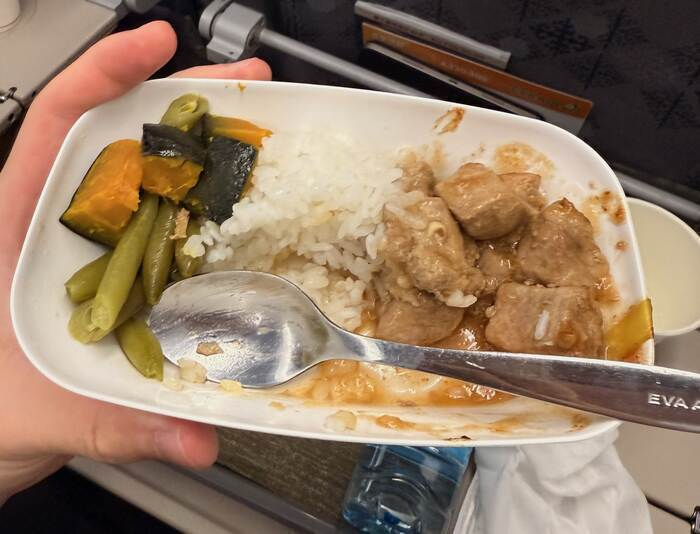
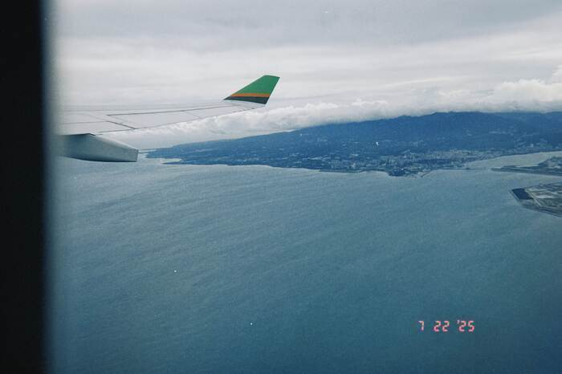
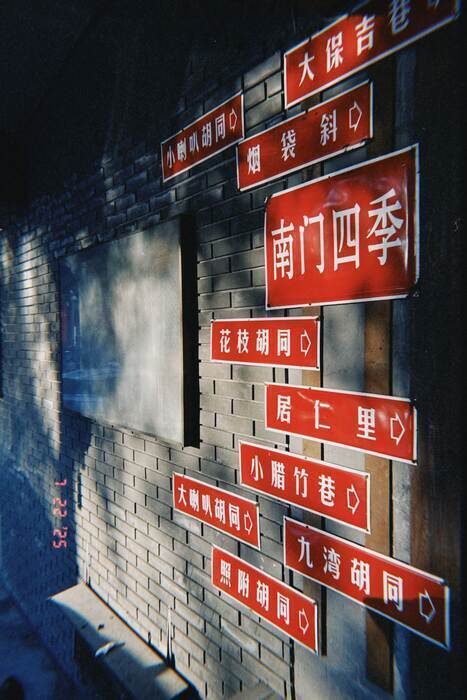
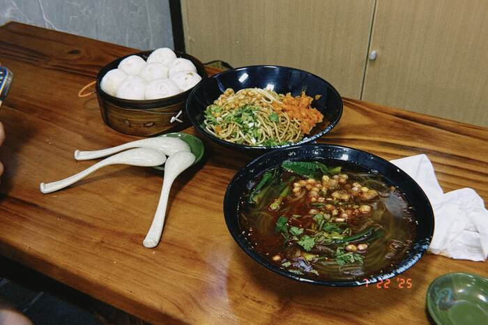

這次為了 [BIRTV](https://www.birtv.com/2025/)（北京國際廣播電影電視展覽會），特地飛來北京看展，謝謝[潤橙](https://reun.com.tw/)的 Paul 哥和[星培](https://www.youtube.com/c/%E6%98%9F%E5%9F%B9Jasper)哥帶我出門開眼界！

趁我還沒開始忙著看展以前，先來分享一些有趣的插曲：

---

### 長榮飛機餐

這是我第二次搭乘長榮航空，這次從桃園搭乘 A333 到北京首都機場，飛機餐的主食意外的還可以？  
肉量蠻多的，調味也還行。

但是不知道為什麼打開的時候有一股濃烈的**燒焦味**，而且甜點真的不是很好吃，我沒有吃完。

---
### 語言自適應

剛好主要語言都是中文，一開始還對腔調不太習慣。不過落地五小時後，好像說話的方式也能自動切換？

---
### 出租車師傅

> 師傅：去哪兒呢？  
> Paul：OO 酒店[^1]。  
>  
> （_🚗 車子開始移動_）  
>   
> Paul：師傅您好，要導航嗎？  
> 師傅：好。  
> Paul：你導還是我導？  
> 師傅：你導吧。  
> Paul：好  
>  
> 我＆星培：_？？？_

（_是說我們在剛要去飯店的路上就差點出車禍了，有一台車在交流道出口的最後五公尺要往左鬼切，看來三寶也是世界級的現象呢⋯⋯_）

---

### 膠片模擬

最近蠻喜歡用 [Dazz](http://dazz.ltd/) 這個軟體拍照，除了可能已經習慣了 iPhone 的鏡頭風格以外⋯⋯

有時候「**不完美的完美**」—— 反而格外吸引我。

膠片的**噪點**、鏡頭光學素質的**不完美**、色彩，質地⋯⋯讓旅行中的拍攝又變得更有趣一些！

---

除了膠片以外，這些東西也帶有「**不完美但吸引人**」的特質：

- [Nord Piano](https://www.nordkeyboards.com/sounds/piano-library/white-grand/) 或 [Keyscape](https://youtu.be/4VlZ3OiRReM?si=NepTPuxbOAn0OYCg) 那種「**髒髒**」的鋼琴**質感**（Texture）   
  （_不知道是不是我聽膩 Keyscape 了，總覺得 Nord Piano 更吸引我？_）
- 電影鏡頭的光暈、解析度「不好」，還有各種光學「**缺陷**」
- **真人演奏**、超厲害的聲音工程師，用類比控台和類比效果器創造出來的不完美聲波  
  （_推薦你 [Daryl Hall & John Oates - Rich Girl](https://youtu.be/AmHE65RAkSY)_）
- 還有很多，想到再來補充！

（_是說，有這些「不完美」特質的東西，好像都[特別貴](https://www.thomann.co.uk/ams_neve_1073_dpd_preamp_stereo.htm)。_）

---
### 酸辣粉

飯店隔壁是一間小餐廳，酸辣粉意外的很好吃！如果有冷氣我應該就能吃完了。

---

展覽明天就開始了，現在是凌晨一點 😴  
	不知道這幾天有沒有機會見到[影視颶風](https://zh.wikipedia.org/wiki/%E5%BD%B1%E8%A7%86%E9%A3%93%E9%A3%8E)的「**好跪好我是 Tim**」呢？

[^1]: 「酒店」在中國是指飯店的意思。
