今天是 [BIRTV](https://www.birtv.com/2025/) 的第一天！從飯店走到展場只需要大約五分鐘的時間。

雖然這幾天北京的天氣其實跟台灣差不多，但第一天換證的隊伍大排長龍，在戶外待久一點其實還是挺熱的。

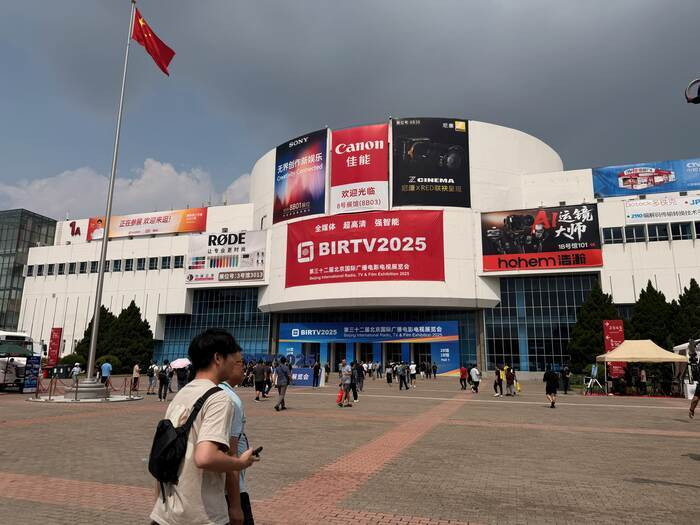

> _門口的 Banner 就是三大單眼巨頭，不知道 Canon 那個位置要多加多少錢？_

---

### 好大

上面圖片的這個館只是「一館」，如果你有去過去年[台北的攝影器材展](https://www.chanchao.com.tw/digital/)[^2]的話，就知道我們只能跟戶外用品展擠在一間，而且還**只有三分之一**的空間 🥲

這是 **BIRTV** 今年的展館地圖，涵蓋了電影、燈光、聲音、虛擬製作、通訊、生成式人工智慧等各種主題。

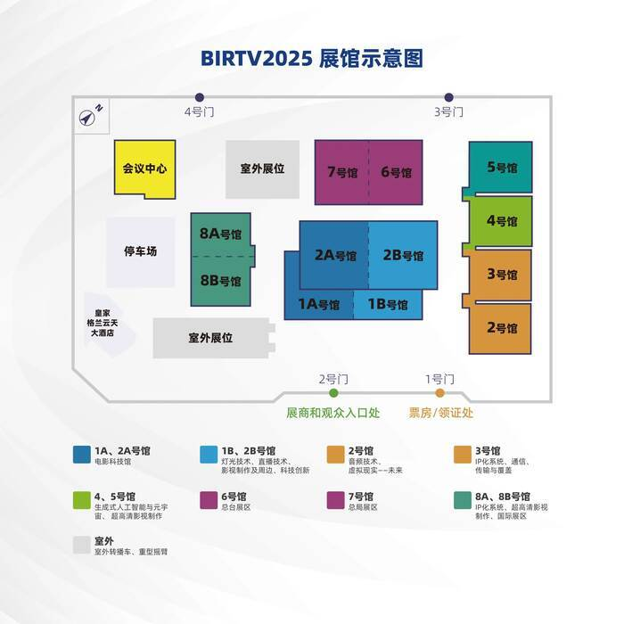

---

而這是**台北攝影器材展**去年 2024 的地圖，藍色的是攝影器材展的內容，真的只有三分之一啊！

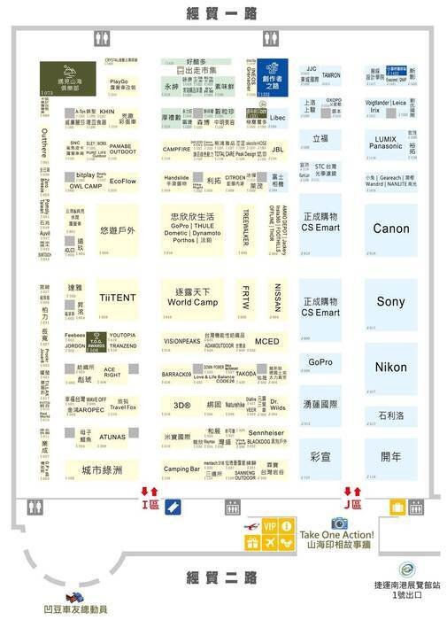

---

### [RED](https://www.red.com/) 真香

一館一進去就是 RED 的攤位，前一天晚上的飯局被推坑了一波，從 US$6,995 [降價](https://www.red.com/stories/komodo-price-drop)到 **US$2,995** 的 [KOMODO 6K](https://www.red.com/komodo) 真的好香啊。[^1]

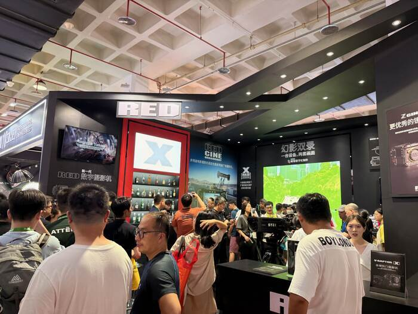

展示區比較親民的系列是 [KOMODO](https://www.red.com/komodo) 和 [KOMODO-X](https://www.red.com/komodo-x) 的 [Monochrome](https://www.red.com/red-101/color-monochrome-camera-sensors) 版本，搭配 Sigma 的 [High Speed Prime 14mm T2 FF](https://www.sigma-global.com/en/cine-lenses/ff-high-speed-prime/14_2/) 跟 NiSi 新出的 [Aureus Prime 50mm T1.4](https://www.nisioptics.at/en/Aureus-Prime-50mm-T1.4-PL-Mount/OB003422)。

我個人比較喜歡的是 **KOMODO 或 KOMODO-X 搭配 Aureus Prime** 的組合，因為機身、鏡頭，還有 V 扣電池配重剛剛好，手持起來很舒服。

---

另外，還有好幾套搭載 [Cine-Broadcast Base Station](https://www.red.com/cine-broadcast) 的 V-RAPTOR \[X]。

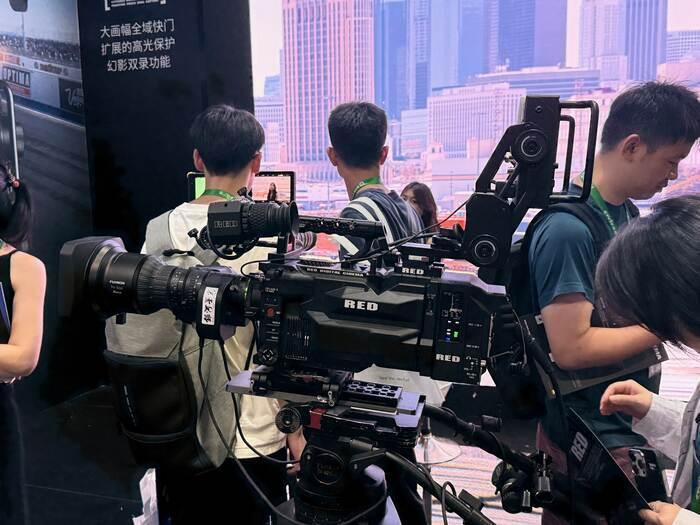

### [NiSi](https://www.nisioptics.com/) Aureas

[Aureas](https://nisiopticsusa.com/product/nisi-aureus-prime-full-frame-t1-4-cinema-lens-kit-18mm-24mm-35mm-50mm-85mm-hard-case-pl-mount/) 算是 [Athena](https://www.nisi-lens.com/athena) 的升級款，在仍然緊湊的體積下，帶來了更好的光學素質、呼吸效應控制，以及雅典娜就有的微反差等特色，光圈更從 **T1.9 變成了 T1.4，整整多了將近一檔**。

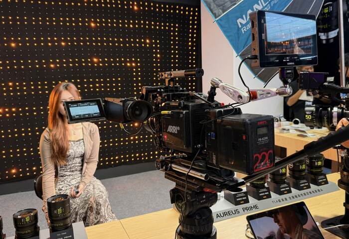

> _這是我第一次碰到 ARRI，但這邊的 Alexa 數量多到我數不出來？_

### [DPA](https://www.dpamicrophones.com/)

兩櫃幾乎把所有常用的 DPA 產品都展出來了，樂器用的 [4099](https://www.dpamicrophones.com/campaign/4099-core-plus/)、槍型麥克風 [4017](https://www.dpamicrophones.com/microphones/shotgun/4017?variant=54)，還有 [4060](https://www.dpamicrophones.com/microphones/lavalier/4060?variant=32) 全指向領夾麥克風。

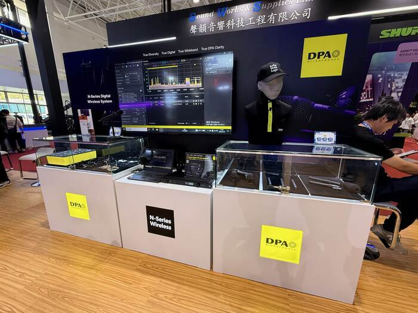

上次拍紀錄片的時候因為 Sennheiser [MKH 50](https://www.sennheiser.com/en-us/catalog/products/microphones/mkh-50/mkh-50-p48-003109) 還沒到貨，臨時跟朋友調了 4017，聲音是真的很**自然又飽滿**，令人印象深刻。

### [Viltrox](https://www.viltrox.com.cn/)

我最印象深刻的是兩顆 LUNA 的變焦電影鏡頭的技術實力展示，焦段分別是 42-420mm 跟 30-300mm。如果沒記錯的話售價好像是 **170 萬人民幣跟 70 萬人民幣**。

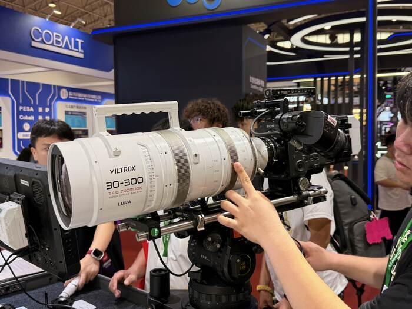

一顆大約 20 公斤，如果不缺錢的話可以拿來裝在 Sony ZV-E1 上面，沒事還能拿來健身 🏋️

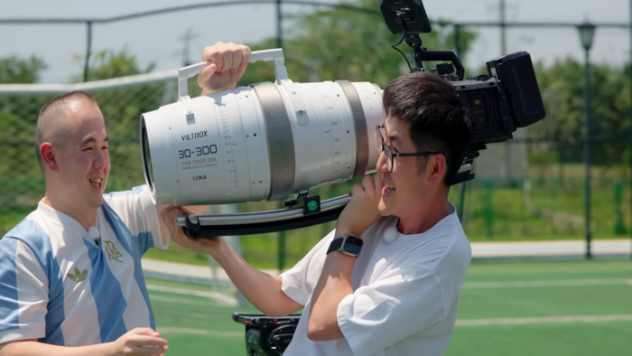

### [DZOFilm](https://dzofilm.com/)

DZOFilm 有三款產品讓我印象深刻，包括：

- Vespid Prime 2[^3]：比一代的 Vespid **重量和體積小很多**，還有 [Cooke /i](https://cookeoptics.com/i-technology/) 的接口
- [Arles Lustre](https://dzofilm.com/en/products/arles-lustre)：Arles 的 Vintage 版本，金色復古的外觀，重點是他的**炫光（Lens Flare）真的很好看**！在有直接光源的情況下可以拍出很有味道的畫面，也讓我想到他們家 [Thypoch](https://thypoch.com/) 推出的 [Simera-C](https://thypoch.com/en/products/simera-c)
- [PAVO 2X Anamorphic](https://dzofilm.com/products/pavo-anamorphic)：兩倍的變形鏡頭，**拉絲（Streak Flare）控制的很好**，不會過度搶戲。變形獨特的散景也很合我的口味。

---
### 羊蝎子是啥？

第一天的 BIRTV 結束後，我們的飯店隔壁就是一間「懂羊帝羊蝎子」，雖然不知道羊蠍子是什麼，但店面看起來就很好吃（？）

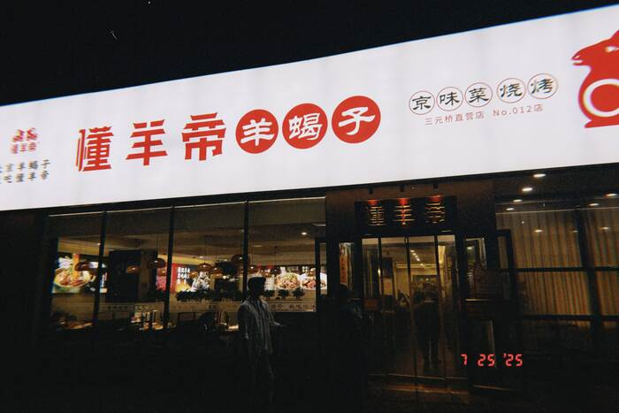

[維基百科](https://zh.wikipedia.org/wiki/%E7%BE%8A%E8%9D%8E%E5%AD%90)上是這樣介紹的：

> 羊蠍子，常誤稱為羊羯子，是指羊從頸尖到尾尖的的脊椎骨，其上附有里脊肉，可用於剁開燉湯，自 1990 年代中期以來流行於北京。從橫切面上看去，**羊龍骨成「丫」字狀，下面還有一個小的分叉，就是蠍子張揚的形狀，因而得名**。多用於火鍋食材或底料食用。

---

我跟星培點了兩道菜和西瓜汁，第一道是「羊蠍子」跟「羊尾」。

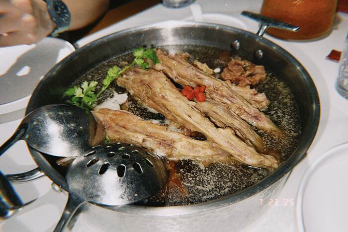

如果你也很喜歡「羊」的味道的話，你一定會喜歡！羊尾（~~_每次唸出來都挺怪_~~）比較有油質，而羊蠍子的瘦肉比較多，還會帶骨髓。

因為湯汁比較重口味，所以相對來說羊騷味就比較不那麼重，但香氣還是在的。

---

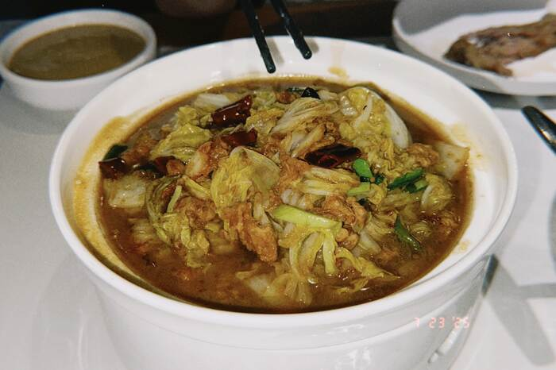

而這道「**油渣大白菜**」，意外的成為這間店的 **MVP**！他有點像台灣的「白菜滷」，但整體口味更重。**油渣的味道充分的被白菜吸收，辣椒的香氣跟白菜的清爽正好解膩**。

天啊，湯汁跟白菜攪飯（kiáu-pn̄g）真的超好吃！我現在隔著螢幕都能聞到它的香氣。

> 星培：我們可以每天都來吃一次嗎？XD

---

### 爐煮又是啥？

跟 Paul 哥聊到凌晨肚子餓，我也想點點看美團[^4]外送，於是 Paul 推薦了「**滷煮**」。

而我又要請出[維基百科](https://zh.wikipedia.org/zh-tw/%E5%8D%A4%E7%85%AE%E7%81%AB%E7%83%A7)了：

> 滷煮火燒是北京特有的一種菜餚，起源於城南的南橫街。以豬的下水和火燒烹製。滷煮火燒來源於清代宮廷小吃「蘇造肉」。「蘇造肉」是乾隆帝游江南時御用廚師發明，用五花肉煮製成。一般人吃不起五花肉，用豬頭肉和下水來代替。
> 
> **將豬肺、五花肉或肥肉、豬大小腸、豆腐（乾豆腐或滷或炸）放進盛有滷湯的大鐵鍋裡煮**。待到臨近中午或傍晚吃飯時間，在老湯中再加入燙麵火燒同煮，隨吃隨盛，其中火燒以外的食材合稱「菜底」。

---

我們點了一個「特色大腸滷煮」跟一個「傳統小腸滷煮」，大約是 40 人民幣（約 160 台幣）。

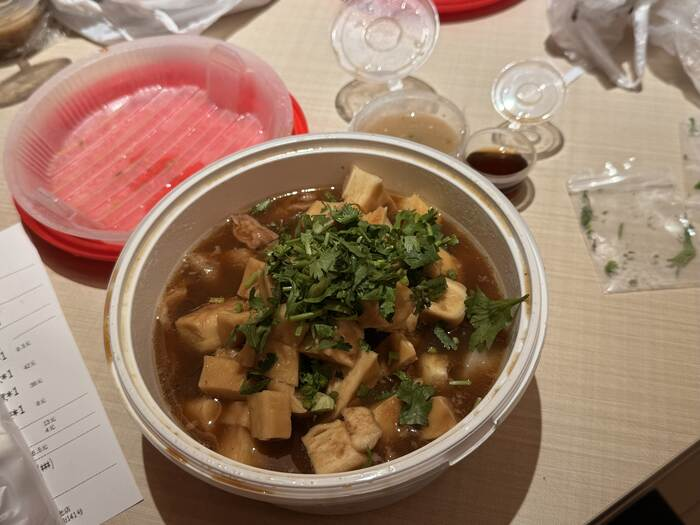

這個烹調的方式聽起來很好吃，但或許是調味上的不同，這碗滷煮我反而沒有吃的很習慣。

---

跟 Paul 聊完之後發現已經凌晨五點了，來的這幾天幾乎每天都看到北京的日出才睡覺 🤣

來北京的行程還有四天，千萬別錯過最後一天登機前的刺激故事 😱

[^1]: 結果回到台灣的路上就打給代理商訂貨了，錢包哭哭 💸

[^2]: 台北攝影器材暨影音創作設備展。

[^3]: 官網上還沒有資訊，但可以在網路上找到今年 NAB 的介紹。

[^4]: 可以理解成台灣的 Uber Eats 或 Foodpanda。
