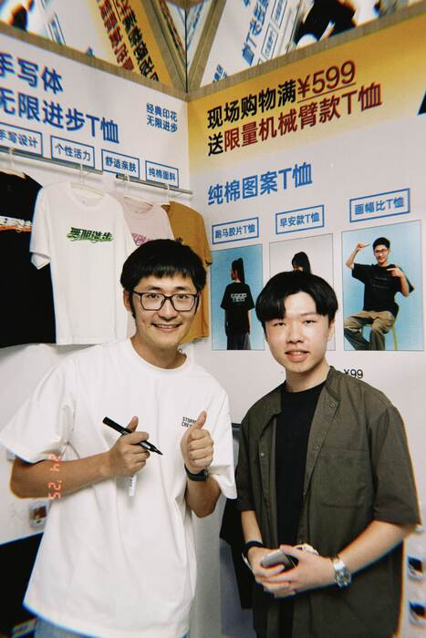
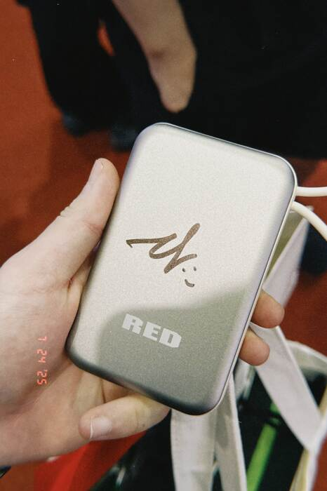
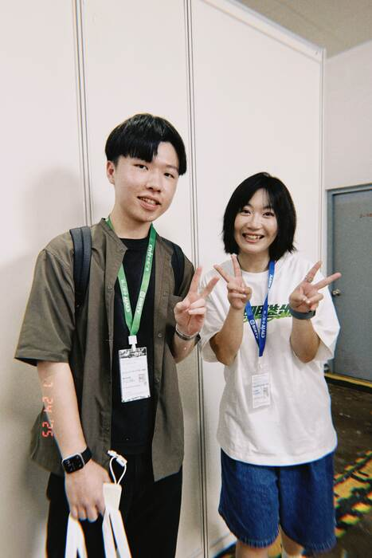
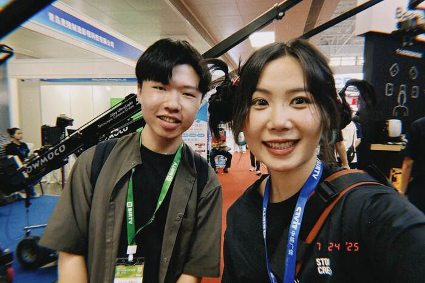
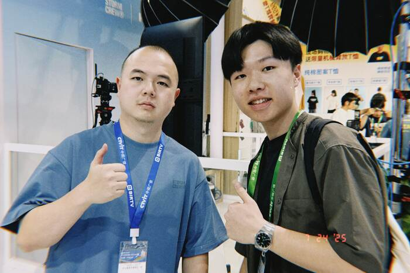
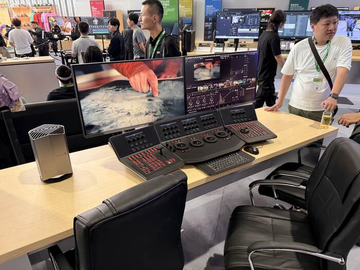
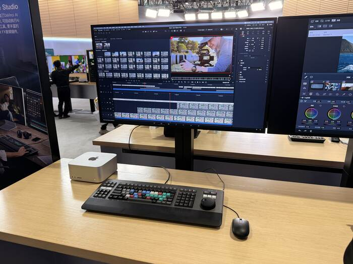
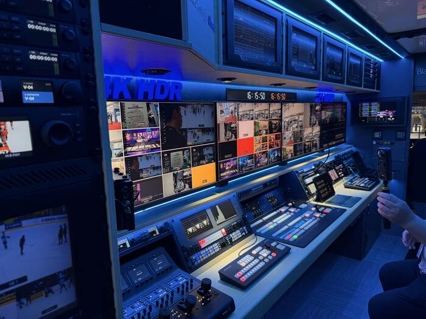
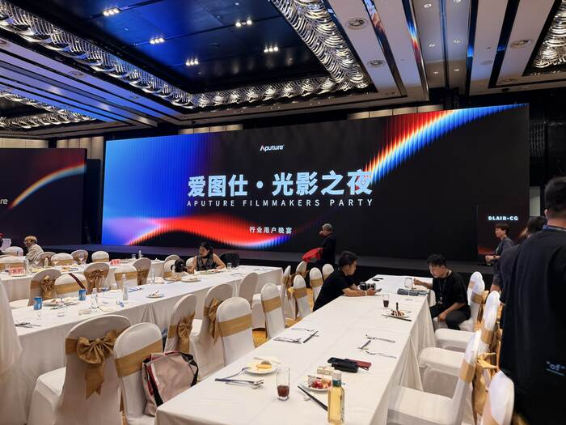
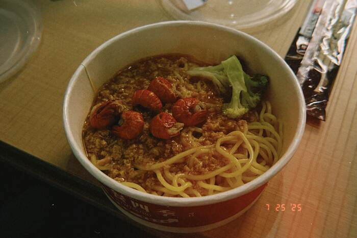

> **北京行系列文章**  
> [第一次來北京](2025-07-22-first-time-in-beijing/index.md) ｜ [一次帶你逛 BIRTV](2025-07-23-birtv-day-1/index.md) ｜ [見到活的 Tim](2025-07-24-birtv-day-2/index.md) ｜ [好事成三](2025-07-26-good-things-come-in-threes/index.md)

昨晚跟 Paul 聊到凌晨 5 點，睡醒已經中午了。結果星培一起床就跟我說：

Tim 今天早上十點出現在展場  
**Tim 今天早上十點出現在展場**  
_**Tim 今天早上十點出現在展場**_

我：😴🥱😮😦😧

<!-- truncate -->

### 是活的 Tim！！！

我大概從 2016 年 Tim 在英國唸書就開始看他的影片，已經將近有十年的時間。

2025 年的他，已經有一個**千萬粉絲**的頻道「[Mediastorm影視颶風](https://www.ysjf.com/)」和一間**百人的製作公司**「杭州星奧傳媒有限公司」。

**我當然不能錯過這個機會啊！！！**

不過 Tim 好像在一邊忙著直播，好像沒什麼精力互動。  
（_如果知道這天會遇到 Tim 我就好好整理瀏海了嗚嗚_）

我還拿前一天在 RED 聚會拿到的行動電源給他簽名！畢竟我們都是擁有 RED 的男人 🤪

---

還捕捉到了其他影視颶風的熟面孔，包括：

企劃部的益君！

調色師青青！

還有李四維！

---

今天還去了一些昨天沒去到的展區，也分享一些有趣的產品。

### [ATOMOS](https://www.atomos.com/)

新款的 [SHINOBI II](https://www.atomos.com/explore/shinobi-2/) 跟 [SHINOBI GO](https://www.atomos.com/explore/shinobi-go/) 基本上一模一樣，只差在**軟體上的閹割**⋯  
（_怎麼現在每家廠商都在搞這招？_）

整體比初代的 SHINOBI **輕薄**很多，而且 SHINOBI II 多了**相機控制**（但是要接線）、**觸碰對焦**，還有 [**EI ZONE**](https://www.elzonesystem.com/) 跟 ARRI 的偽色。

整體來說還蠻推薦的！我自己也還在使用初代的 [SHINOBI SDI](https://www.bhphotovideo.com/c/product/1470081-REG/atomos_atomshbs01_shinobi_5_3g_sdi.html) 版本。

### [Blackmagicdesign](https://www.blackmagicdesign.com/)

他們展場的**工作人員都不太理人耶**！是我看起來太年輕了嗎？

[Davinci Resolve](https://www.blackmagicdesign.com/products/davinciresolve) 後期相關的產品展的不多，只有 [Speed Editor](https://www.blackmagicdesign.com/products/davinciresolve/techspecs/W-DRE-13)、[Editor Keyboard](https://www.blackmagicdesign.com/products/davinciresolve/techspecs/W-DRE-12)、[Micro Color Panel](https://www.blackmagicdesign.com/products/davinciresolve/techspecs/W-DRE-16)，跟 [Advanced Panel](https://www.blackmagicdesign.com/products/davinciresolve/techspecs/W-DRE-06) 而已。  
我比較想看 [Mini Panel](https://www.blackmagicdesign.com/products/davinciresolve/techspecs/W-DRE-09) 跟 [Fairlight](https://www.blackmagicdesign.com/products/davinciresolve/fairlight) 相關的 Console。

**Advanced Panel**，售價 US$31,089。

**Editor Keybaord**，售價 US$655。  
我還蠻想要這個的耶！因為用 Speed Editor 還是常常會需要鍵盤跟滑鼠切換，但這款直接把兩個功能整合在一起了。

然後還有一台聽說是借來的 OB （[Outside Broadcast](https://en.wikipedia.org/wiki/Outside_broadcasting)）車。

### [Aputure](https://aputure.com/) 的晚宴

晚上參加 Aputure 的**行業用戶晚宴**，認識了很多厲害的創作者跟攝影指導！

他們今年新的技術的是 **BLAIR** 跟 **BLAIR-CG**，BLAIR-CG 分別代表著：

- **B**lue（藍色）
- **L**ime（淺綠色）
- **A**mber（琥珀色）
- **I**ndigo（靛藍色）
- **R**ed（紅色）
- **C**yan（青色）
- **G**reen（綠色）

比起過往燈珠的排列組合，**BLAIR-_CG_** 可以覆蓋 90% 的 Rec2020，提供更廣的色域和顏色光創作者選擇，目前已經應用在 [STORM 80c](https://aputure.com/products/storm-80c) 和 Nova II[^1] 上。

而 **BLAIR** 目前則應用在最新的 [STORM 400x](https://aputure.com/products/storm-400x) 上，它的 Indigo（靛藍）燈珠能模擬自然光與鎢絲燈光譜，讓 LED 光源更接近太陽光與鎢絲燈的質感。

這個影片展示了 BLAIR-CG 的效果（[在 YouTube 上觀看](https://www.youtube.com/watch?v=影片ID)）：

<iframe
  class="custom-iframe"
  width="100%"
  height="400"
  src="https://www.youtube-nocookie.com/embed/lPRpeiU6dLY?modestbranding=1&rel=0"
  title="Aputure Blair-CG Launch | Live Event Lighting Demo"
  frameborder="0"
  allow="accelerometer; autoplay; clipboard-write; encrypted-media; gyroscope; picture-in-picture"
  allowfullscreen>
</iframe>

他們現場播放的 Demo 把 BLAIR-CG 的性能示範的很完整，但會讓我拿出手機拍的原因是，視覺真的做得**好用心**！

旁邊的兩個螢幕居然會**跟著影片的內容變色**，讓我想起我之前做的另一個專案，是視訊畫面結合 DMX 控制 RGB 燈光。

---

### 蟹黃拌麵

今天也想點點看外送，星培選了「鵝肝黃金蟹肉蟹黃拌麵」，我點了個「蟹黃蟹肉龍蝦拌麵」，長這樣：

一碗才不到 30 人民幣（約 120 台幣），我覺得味道也有點普通，小龍蝦的肉一直卡在殼裡吃不到哈哈哈。

不過連續兩天的 Social 局結束，也有點懶的再找附近的美食，這時候只想趕快吃完躺平 😪

---

**延伸閱讀：北京行系列**  
- [第一次來北京](2025-07-22-first-time-in-beijing/index.md)  
- [一次帶你逛 BIRTV](2025-07-23-birtv-day-1/index.md)  
- [見到活的 Tim](2025-07-24-birtv-day-2/index.md)  
- [好事成三](2025-07-26-good-things-come-in-threes/index.md)

[^1]: Nova II 尚未公開發佈資訊。讓你們搶先知道了！
