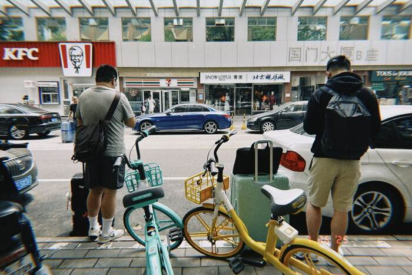
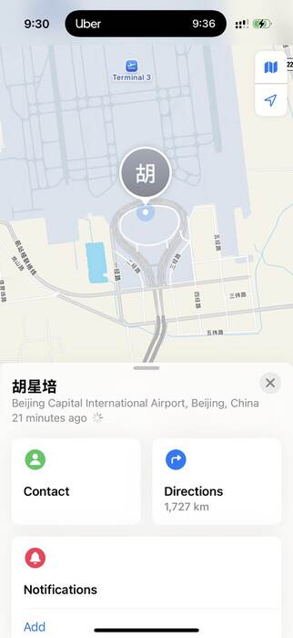

> **北京行系列文章**  
> [第一次來北京](2025-07-22-first-time-in-beijing/index.md) ｜ [一次帶你逛 BIRTV](2025-07-23-birtv-day-1/index.md) ｜ [見到活的 Tim](2025-07-24-birtv-day-2/index.md) ｜ [好事成三](2025-07-26-good-things-come-in-threes/index.md)

這幾天在北京都看到日出才睡，所以昨天幾乎都在休息，就沒有特別寫出一篇文章。時間過得很快，已經離開了，沒想到今天發生的事情比遊戲還刺激？

（*是說，北京的肯德基有賣牛排跟義大利麵耶？而且牛排還蠻好吃的，真神奇。*）

<!-- truncate -->

### 最後 30 秒

*前情提要：當初是 Paul 哥先買機票，我才幫我跟星培一起買。*

因為大家都累了，幾乎是最後一刻才到機場，我們一到就趕著去辦行李托運。結果，Paul 的行李托運完之後，櫃檯卻跟我們說，找不到我跟星培的資料。不是，雖然[油渣大白菜](2025-07-23-birtv-day-1/index.md#羊蝎子是啥)很好吃，但我沒有想要重買機票欸 😍？

後來我們發現，我們根本就沒有買到跟 Paul 同一班飛機啊！兩班只差五分鐘！

這時候距離飛機起飛已經剩下一個小時又兩分鐘，代表我們要在一分鐘內找到我們的櫃檯[^1]。我們兩個推著行李車在北京首都國際機場奔跑，還好我們在最後 30 秒找到櫃檯，否則又要多吃一餐肯德基牛排了哈哈哈哈。

### 1,727 公里

好不容易在最後趕上托運、通過安檢，搭接駁地鐵時我跟星培還在開心地討論我要不要買 RED KOMODO。結果到了候機區，他摸摸左邊的口袋跟右邊的口袋，怎麼摸不到手機 😍？驚魂未定的我們直接再被嚇出一波冷汗，我趕緊打電話給他的手機，結果接起來的是一個女生的聲音：

>「您好，您的手機掉在安檢這邊了。但我看您的飛機好像已經到了登機時間，您要回來拿嗎？但有可能會搭不上飛機。」

心都涼了。手機跟機票只能二選一。  
後來，星培決定先登機。

還好，還有參展的廠商隔天才回台灣，最後也成功拿回了手機，但也成就了這張經典的「距離 1,727 km」的螢幕截圖：

### 特斯拉智慧召喚

經歷一波三折之後，終於回到台灣。到了 Paul 停車的地方，他跟我們展示了 Tesla 的智慧召喚功能，星培還開玩笑說：「如果我有手機我就拍下來！」

結果下一秒 ——  
Tesla 直接去 A 到停車場的柱子。

我是沒拍啦，但網路上可以找到很多悲傷的案例 🥲

<iframe
  class="custom-iframe"
  width="100%"
  height="400"
  src="https://www.youtube-nocookie.com/embed/cxoEze3UqXQ?modestbranding=1&rel=0"
  title="Tesla Model S Smart Summon Wrecked Leaving the Garage"
  frameborder="0"
  allow="accelerometer; autoplay; clipboard-write; encrypted-media; gyroscope; picture-in-picture"
  allowfullscreen>
</iframe>

好吧，至少 Paul 有保全險。

---

**延伸閱讀：北京行系列**  
- [第一次來北京](2025-07-22-first-time-in-beijing/index.md)  
- [一次帶你逛 BIRTV](2025-07-23-birtv-day-1/index.md)  
- [見到活的 Tim](2025-07-24-birtv-day-2/index.md)  
- [好事成三](2025-07-26-good-things-come-in-threes/index.md)

[^1]: 長榮航空規定國際線報到與行李托運（Bag‑drop）需在航班起飛前 1 小時完成，逾時櫃檯有權拒絕托運及登機。