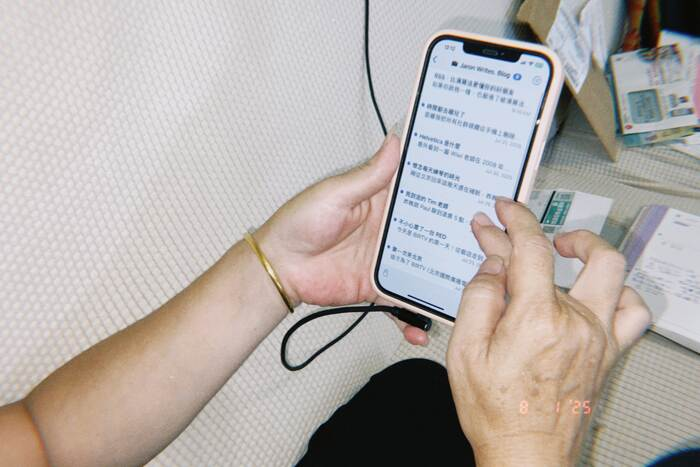

如果你跟我一樣，也[厭倦了被演算法操控的首頁](2025-07-20-why-blog.md)（同時也為了讓我的大腦獲得[即時的獎勵](2025-07-31-distraction-free.md#即時的獎勵)），並且把我的文章塞進你各位的手機中，我想是時候來教大家怎麼訂閱你有興趣的 RSS 內容了！

### 為什麼你該試試 RSS

RSS 其實是一個 1999 年就有的標準，好奇的人可以去[維基百科](https://zh.wikipedia.org/zh-tw/RSS)看看詳細的介紹和歷史，但我們只需要知道：

> RSS 就像是幫你**訂報紙的郵差**。
> 
> 你喜歡的網站會有一個「RSS 檔案」（就像郵局的派送清單），裡面列出了最新的文章。
> 然後你的 RSS 閱讀器（郵差）每天會自動去抓這份清單，把新內容送到你的 RSS App 裡，**完全免費、沒有廣告、沒有演算法干擾，既有效率又乾淨**。
> 
> 所以，你不用每天去逛 10 個網站找更新，只要打開 RSS 閱讀器，所有最新文章都已經幫你收集好了。

聰明的你一定會覺得困惑，既沒有廣告、沒有演算法可以左右內容、又沒有短影片可以[搶走我的注意力](2025-07-31-distraction-free.md)，更不會在我在乎的朋友的貼文中來一則詐騙廣告，我[最喜歡的社群媒體](2025-07-20-why-blog.md)們怎麼可能會給我這麼好的東西呢！

<!-- truncate -->

那就對了。Facebook 早在 2015 年就[把官方的 RSS 給關閉了](https://developers.facebook.com/docs/graph-api/changelog/version2.3#v2_3_90_day_deprecations)。如果給你們這麼好康的，那我要怎麼知道你用哪一牌的手機、住在哪、你最好的朋友是誰、跟前女友在什麼時候分手（或許比你以為的還早）、你晚上會不會打開外送 App 點一份鹽酥雞，甚至能知道凌晨三點還在暈船對象的貼文停留了 27 秒？

這些平台**比你還要了解你自己**，他們可以再把這些資料名正言順的跟「廣告合作夥伴」共享（畢竟你都在註冊帳號的時候同意了）。就算你關掉定位、登出帳號，甚至用無痕模式，他們還是能憑藉一些零碎的特徵[^1]，**把你從幾十億個用戶中精準的抓出來**。

不然你以為，這些社群平台怎麼會是免費的，難道是做身體健康的嗎？換句話說，使用者們正在把自己珍貴的注意力、時間、努力賺來的薪水[^2]，跟你自己都不知道的秘密，拿來訂閱了這些「免費」的社群平台。

（*就在我寫這篇文章的當下，[Mark Zuckerberg 的身價超過了 Jeff Bezos](https://www.forbes.com/sites/tylerroush/2025/07/31/zuckerberg-overtakes-bezos-for-worlds-third-richest-person-as-meta-rally-adds-28-billion-to-his-fortune/)，來到 2,684 億美元，世界排名第三。或許這就是我們「免費」使用社群媒體的代價。*）

### 快教教我吧

好消息是，我們其實還有選擇。除了社群媒體以外，大部分的網站仍然提供了 RSS 訂閱，包括[我們最愛的 YouTube](2025-07-21-youtube-has-changed.md)。先來介紹閱讀器的部分。

我現在主要使用的 RSS 閱讀器是 [NetNewsWire](https://netnewswire.com/)，完全[**開源**](https://github.com/Ranchero-Software/NetNewsWire)並且**免費**！提供了 [Mac](https://netnewswire.com/NetNewsWire.zip) 和 [iOS](https://apps.apple.com/us/app/netnewswire-rss-reader/id1480640210) 版本。雖然介面看起來比較舊一些些，但該有的功能都有，支援透過 iCloud 同步，而且跑起來超級快。他們的[開發哲學](https://netnewswire.com/philosophy.html)是「App 不應該崩潰，應該沒有 Bug，而且要足夠快速。」（*瞥了一眼 Windows*）

另外一款我這幾天開始嘗試的是 [News Explorer](https://betamagic.nl/products/newsexplorer.html)，只要 $320 元就能買斷 [Mac 版本](https://betamagic.nl/store.html)，還有 $150 元就可買斷的 [iOS/iPad/Watch/TV 版本](https://geo.itunes.apple.com/us/app/news-explorer/id1032668306?ls=1&mt=8&at=1000lqMt&ct=store-newsexplorer-ios)。他比 NetNewsWire 更現代、好看一點，介面更像我們習慣的網站的閱讀方式。反正可以買斷，也提供 14 天的免費試用，歡迎你去試試看！

Windows 跟 Android 的使用者們，可能得研究一下 Reddit 上的朋友有沒有什麼推薦的好選項。如果你有推薦的軟體，可以寫信到 hi@fattie.io 跟我分享，我會趕緊更新在文章裡的。

### 怎麼找到 RSS 網址

#### 我的部落格

不囉唆，這是這個部落格的 RSS 網址，請先試著在你剛剛下載好的閱讀器上加入我的網站（笑）

`https://jaron.tw/blog/rss.xml`

#### YouTube

YouTube 的 RSS 稍微麻煩一些些，建議使用電腦操作會比較容易。

1. 前往你想訂閱的頻道首頁。
2. 點一下「顯示更多」。
3. 點一下「分享頻道」>「複製頻道 ID」。
4. 將複製好的頻道 ID，貼到以下的咒語末端。

`https://www.youtube.com/feeds/videos.xml?channel_id=[頻道 ID]`

舉例來說，像我的 YouTube 頻道的 RSS Feed 就是 `https://www.youtube.com/feeds/videos.xml?channel_id=UCT80xDnMqqK0FRH_h8IofkA`。

雖然有一點麻煩，但會值得的。可以順便趁這個機會過濾一下你的推薦內容，試著挑出三個你最想花時間關注的創作者吧！（*我應該可以佔第四個名額吧？我一年才更新三隻影片，嘻嘻*）

#### 其他網站

比較好心的網站或許能在底部或側邊欄找到一個 RSS 的圖案，但我想最快的方式是直接在網路上搜尋「某某網站 RSS 網址」。

---

如果你也厭倦了演算法替你決定要看什麼，不如現在就花 5 分鐘，幫你的生活加點你真正想看的東西吧。（當然，先從我的部落格開始）。

也恭喜你，離更安靜的生活又更進一步了！

### 後記

在我發佈文章不到半小時後，我媽已經自己載好 NetNewsWire，還訂閱了我的部落格耶！你還不趕快試試看嗎？

[^1]: 舉例來說，像是你的 IP 位置、瀏覽器類型與版本、作業系統、螢幕解析度、安裝的字體跟外掛程式、時區和語言設定，甚至你的滑鼠移動和打字行為。這些東西單看一個都無法準確識別你，但組合起來就能形成一個幾乎**獨一無二的數位指紋**，用來追蹤或分析使用者行為。

[^2]: 別讓我開始講購物網站那精準到噁心的廣告⋯⋯連你自己忘了加到購物車的東西，它都能提醒你。
