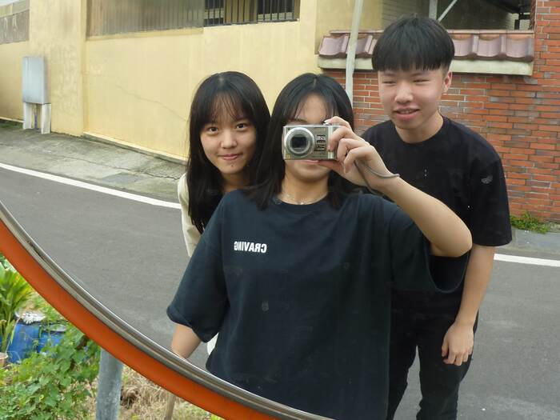
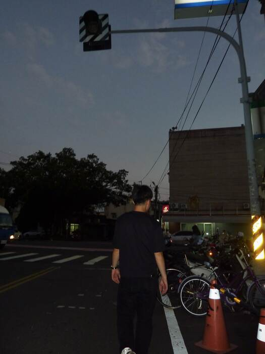
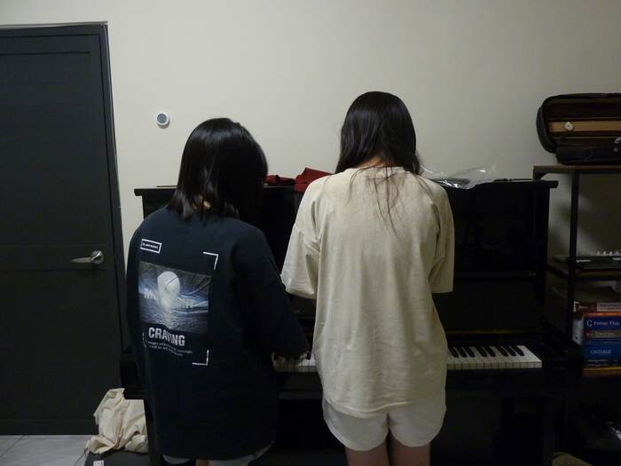

[兩位大學的朋友](2025-08-02-living-before-creating.md#我沒有生活)發現我除了把房間設計的非常適合進行影片和音樂的創作之外，還是一個完美的娛樂空間。所以，來我家玩已經變成每月的例行公事。我們今天玩了：

- 過量的 [Home Sheep Home](https://shaunthesheep.com/games/home-sheep-home/)，因為難度適中，會讓人想每關都拿下完美的紀錄
- 一點點[雙人成行](https://www.ea.com/zh-hant/games/it-takes-two/it-takes-two/features)，節奏輕鬆但打 boss 時會很機車的解謎小品
- 一些[超級瑪利歐派對](https://www.nintendo.com/us/store/products/super-mario-party-switch/)，音樂遊戲真的很適合一群人一起玩
- 一點 [Ultimate Chicken Horse](https://www.cleverendeavourgames.com/ultimate-chicken-horse)，跟 [Overcooked!](http://www.ghosttowngames.com/overcooked/) 一樣都是友誼破壞遊戲

<!-- truncate -->

（*而且，躺著玩遊戲真的超爽的耶！原來天花板漆成白色是為了方便投影用的*）

### 17 歲的數位相機

我朋友手上拿的相機是 Panasonic 在 2009 年推出的 DMC-TZ7，距離發佈已經過了將近 17 年了，是我爸媽很久以前買的相機，這幾天在整理防潮箱的時候意外翻出來的。除了變焦有點卡卡的以外，其他的功能居然都正常，電池也都還能正常運作。我是很難想像我現在[桌上擺的東西](/use)有哪些可以陪我 17 年啦。

跟你們分享一些今天我們隨手拍的相片。我覺得他稱不上是復古的風格，代表那時候的這種數位相機技術就已經很厲害了耶。唯一比較明顯的問題，大概就只有光線比較暗的室內，噪點就會比較多。不過說實話，我覺得他能開機、還能拍照，我就已經心滿意足了哈哈哈。

拿著它好像就會想多拍一些生活的小碎片，是平時用手機可能不會想記錄下來的。

