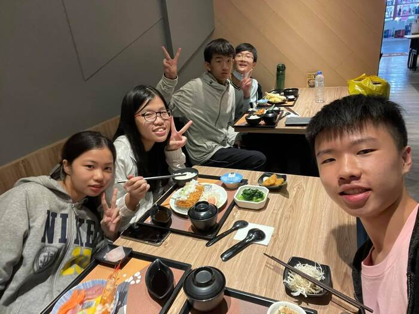

這是一趟三天兩夜的畢業旅行，從雲林到台南，從台南到高雄，從高雄到墾丁，再回到雲林。一切似乎過了一個月，又好像只有幾小時一般的短暫⋯

<!-- truncate -->

### 2020/12/2 Day1 😆🥳

#### 🚩 台南安平老街（景點1）

從學校出發的第一站就一路殺到了台南，在車上大家還很害羞，不願意開口唱歌。第一站就來到台南必逛的安平老街，仔細地聽了關於台南特有的劍獅故事，為我們三天兩夜的旅行揭開了序幕。炎熱的天氣擋不住大家的熱情，買了呱呱推薦的彎彎冰，讓大家清涼一下。  

> 「咬著劍的獅子叫做劍獅，拿著劍的人叫做劍人。」

#### 🚩 旗津海岸／公園星空隧道／旗後砲台（景點2）

吃過午餐後，從台南一路坐著遊覽車來到了高雄。到了旗津，看到超漂亮的風景，肯定是要拿起手機拍爆照片的啊！走在海洋公園的路上，沿路都是海，手機的快門忍不住多按了幾下。走過星空隧道，到了離海更近的地方，看著海浪拍打起伏，大家都興奮地尖叫了起來。看完海拍完網美照後，繼續往上走，到了旗後砲台。雖然旗後砲台沒有砲台，但也是個適合拍照的好地方。在上面的風很大，大家為了拍照都在所不惜，風再怎麼大都願意冒著被吹走的風險（誤。

回到海岸公園，自由時間買了全台幾乎絕種的思樂冰，我還跟小七店員說成：「麻煩給我四杯星冰樂，謝謝。」拿著小時候最愛的思樂冰，邊走邊喝，結果發現這味道好像特別的甜，~~毀了小時的美妙想像~~。還買了蕃茄切盤、20 年老店的烤小卷，上了遊覽車，準備前往下一站。

#### 🚩 駁二藝術特區（景點3）

到了駁二之後，~~我搖擺地走在金色的沙灘上~~，我們走在高雄街頭，到了誠品生活，沒買書卻印了兩張 $50 的照片。繼續往前走，看到別班的同學已經玩到整臉都是彩繪 w。我們看了沒有在旋轉但會旋轉的橋，還被拍網美照定格在河岸。到了前方的盪鞦韆又拍了照，上完廁所拍拍屁股，準備前往今日最期待的「夢時代」🎡。

#### 🚩 夢時代（景點4）

進了夢時代，和星巴克拍了一張照，作為避免迷路的據點，大家就放風去了。我們一群人興奮地衝到頂樓，準備搭上我睽違了六年的摩天輪。像個孩子般的跑到摩天輪前拍照，又馬上衝到售票口購票，終於搭上摩天輪。抵達的時間正好是天色逐漸轉暗，一邊看城市風光，一邊望著高雄港。但，15 分鐘咻一下就過去了。可以確定的是：iPhone 12 Pro Max 的夜拍能力是真滴強。

和同學去逛了百貨公司、在 7-11 買泡麵，還買了爭鮮盒裝壽司（標準吃貨）。收起愛玩的那顆心，準備回到飯店，繼續享受旅程中的每個時光。

#### 🚩 高雄康橋飯店 - 七賢旗艦館（景點5）

放好行李，到了飯店的自助宵夜區，繼續填飽肚子，晚上才有力氣可以嗨（X。用過晚餐之後，還有甜點，但我早已吃不下誘人的起司蛋糕。和同學到了外面，只要朋友聚在一起總是特別開心。網美見習課程正式開始，訓練大家的拍照技術 XD。燈光美氣氛佳，大家都笑得不可開交（咦）。歡樂的時光總是過得特別快，十點前大家趕回房間。玩到凌晨兩點後，進入快速充電模式，睡覺 💤 ⋯⋯

### 2020/12/3 Day2 😱

#### 🚩 高雄義大遊樂世界（景點6）

用過康橋的自助早餐（薯餅配沙拉醬是天生一對），我們來到了義大遊樂世界！今天的隨身背包很簡單，只有一隻巨大咖波。經過標準的拍照 SOP 之後，帶我們來到了海盜船（第一關就海盜船會不會太刺激：O）。整個過程我心裡唯一的念頭只有：「快放我下去。」下來之後我整個人像失了魂魄一樣 XD，站在旁邊看著同學玩 Crazy House，當著人體置物櫃。

沒想到接下來隊輔帶我們來到「地心歷險」⋯⋯幸好同學陪著我，才沒錯過這超超刺激的回憶。同學還超幸運的在遊行時拿到曼陀珠 🍬，走在義大裡面真的有在城堡裡面的 Fu。每個工作人員都超敬業，連開車的人都會跟我們揮手！用完午餐、拍了爆多的網美照，搶在集合前逛了 5 分鐘 Shopping Mall 後，準備前往今日最後一站——墾丁大街。

#### 🚎 離開地球表面／FLY OUT／最炫民族風／練武功

原本很 ㄅㄧˋ ㄙㄨˇ 的我，在這時頓時解放，和大家一起在車上飆歌，或許是意識到這趟旅行已經過了一半。

> 「嗨到離開地球表面 這樣太危險 一路邊走邊唱才是最自在 Everybody 的心情都好像十八歲。」

翻了那本 8kgw 重的歌單，終於找到一首我會的 Just the Way You Are。瘋狂被切歌，終於等到最後一首是我的，結果播出來是一首同名不同首的歌 🙄️ ⋯⋯

#### 🚩 墾丁大街（景點7）

在路途中用了晚餐，也到了最後一個晚上的行程！此時墾丁的風大到可以把同學吹走，我的帽子還差點 Say Goodbye。「*請問你掉的是這頂隱形的帽子還是這頂黑色的帽子ㄋ*？」喝了 QQ 蛋奶、吃了炸牛奶、血拼衣服、買了滷味和氣泡水。我們心滿意足地拿著戰利品，頂著冷到爆的寒風，緩緩回到集合地點⋯⋯

#### 🚩 墾丁福華大飯店（景點8）

例行公事放完行李後，網美見習集會又出來準備開趴踢了。找了個燈光美氣氛佳的地方，我高興打開氣泡水，沒想到它直接噴發，逗得大家狂笑 w。開完飲料後，正要打開滷味時被服務人員勸阻，只好轉移陣地。又選了個燈光美氣氛佳的地方（其實只是飯店走廊），開始享受最後一晚的宵夜 time。吃著滷味、喝著氣泡水、唱著歌，大家的心情一點也沒有被最後一晚的哀傷氣氛影響 ❤️。今晚我們依然活力滿分，洗澡兼泡澡，兩點準時睡覺。

### 2020/12/4 Day3 🌊🥺

#### 🚩 飯店沙灘（景點9）

「鈴鈴鈴～」同學的鬧鐘差點讓我把手機丟進浴缸，從 6:00 一路響到 6:40，而且定鬧鐘的人永遠不會醒 .\_. 墾丁的低溫快把我們凍成冰棒了，被窩是我最好的歸屬，但再不起床今天行程就有可能泡湯。

用完早餐後，穿著短袖短褲，來到飯店的沙灘。望眼放去是無際的海平面。第一次親耳聽到海浪聲，超震撼。我們開始班級沙灘躲避球競賽，為了趕快自由而故意輸掉（喂）。開始拍照的 SOP 喀擦喀擦後，大家就玩瘋了。呱呱成為第一個被埋沙的人，之後是我們班的男生們，差點猜拳輸的我表示緊張，但看起來好像也挺好玩的 XD。

玩完棄屍遊戲後，開始親近海浪。一開始靦腆地感受拍打感，拍完照之後大家開始互推下水 www。阿寶給了我一個溫暖的擁抱，讓大家開始潑我水 XDD（海水粉鹹）。全身沙子又濕漉漉，回到飯店前沖掉沙子，風超大，整個人快凍僵了。換完衣服後，差點遲到的我們奔向遊覽車，準備迎接最後一個景點。

#### 🚩 海洋生物博物館（景點10）

我們一起看了搖搖晃晃的企鵝 🐧、象魚 🐠、美味的龍膽石斑 🤤、鎚頭鯊 🦈、繞圈圈的銀鱗鯧 🐟、開七彩趴踢的水母 🌈、招潮蟹 🦀️、估溜的彈塗魚 🎣、小白鯨 🐋、花園鰻 😪、披豹紋的魟魚 🩲。拍完此趟旅程的最後一張大合照，坐上遊覽車準備回家 🙂。

#### 🚎 暖暖／真的傻／小蘋果／9453／告白氣球／小幸運／稻香／隱形的翅膀

經歷了一天 4:44 和一天 4:33 的睡眠後，我們一上車就睡成一片💤。到了休息站，下車放風尿尿後，一路 K 歌回學校！特別珍惜最後這幾個小時，大家都用力地唱、用力地玩。用力地享受屬於自己唯一一次的青春。

#### 🚩 賦歸（返程）

走進校門，和主任打了招呼，拍了最後一張自拍照。回想第一天的點滴，彷彿像是一個月前，又好像只是幾小時前才離開學校。但一晃眼，我們卻帶著滿滿回憶，一起回到了這裡。不想分別的我們，索性約著去吃晚餐。來個網美式道別，最後一次說再見。  

Btw，海鮮丼飯好ㄘ。

---

轉瞬間就打了 3,500 多字，希望每個人看到都能和我一樣開心 😆。謝謝和我一起創造這些回憶的人。今後，我們也要一起創造更多回憶 🙂