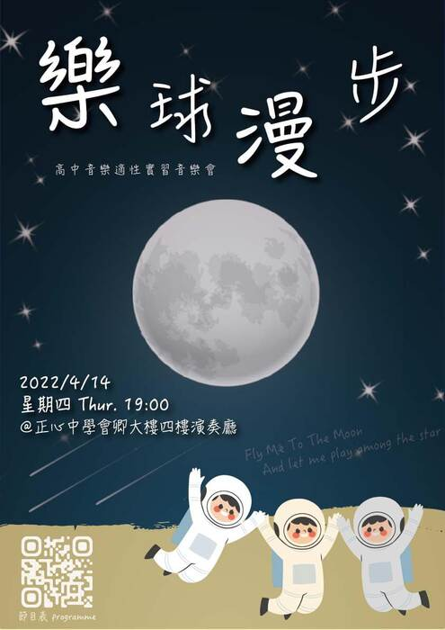
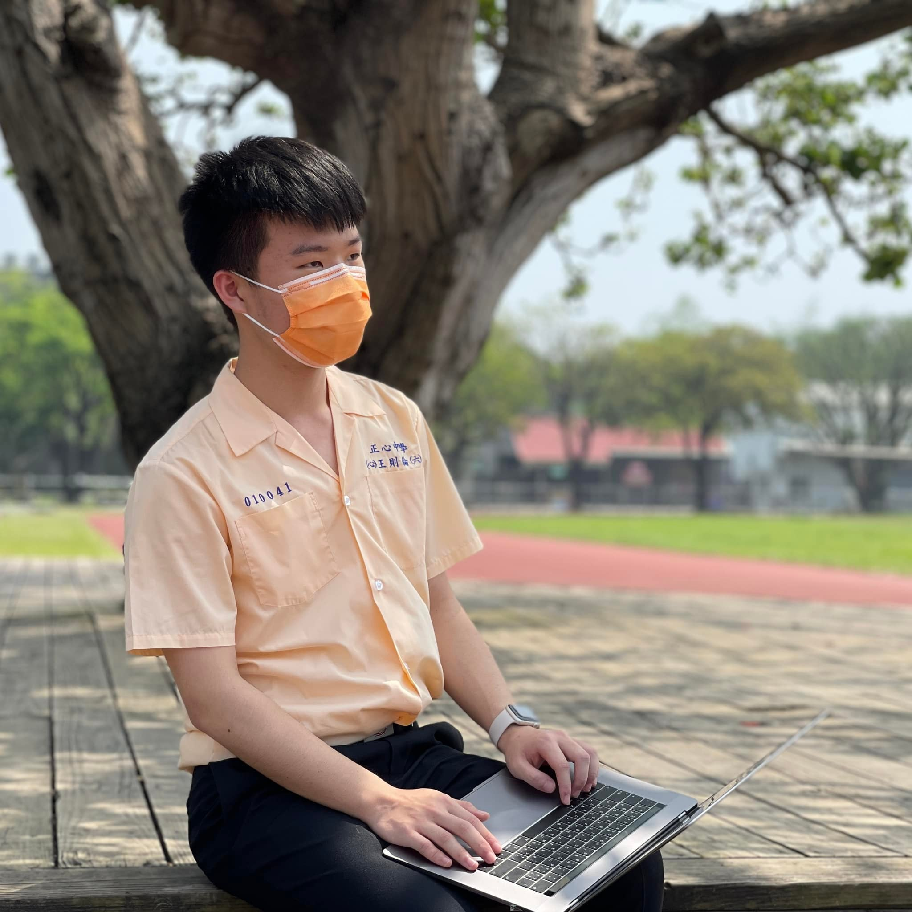
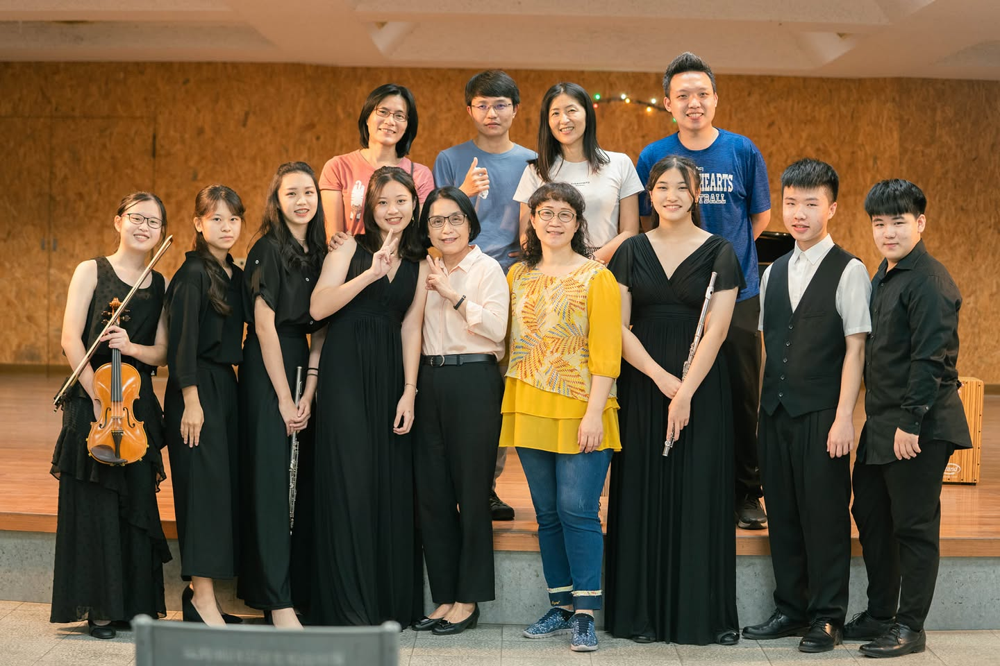
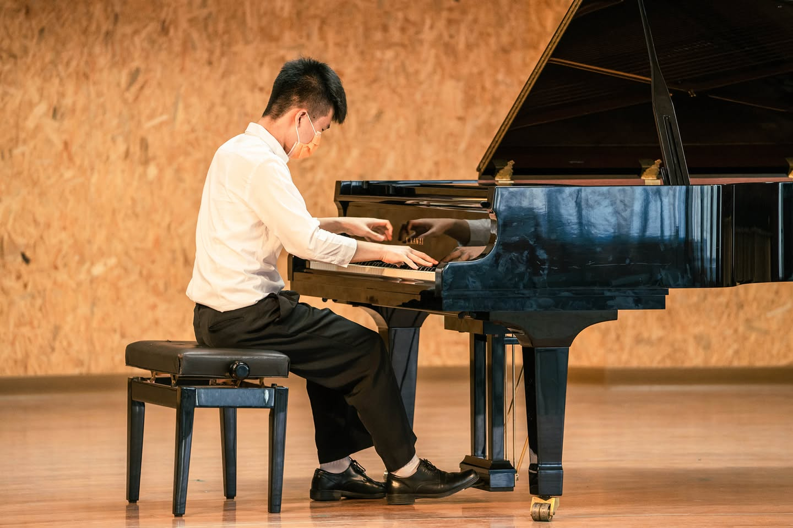
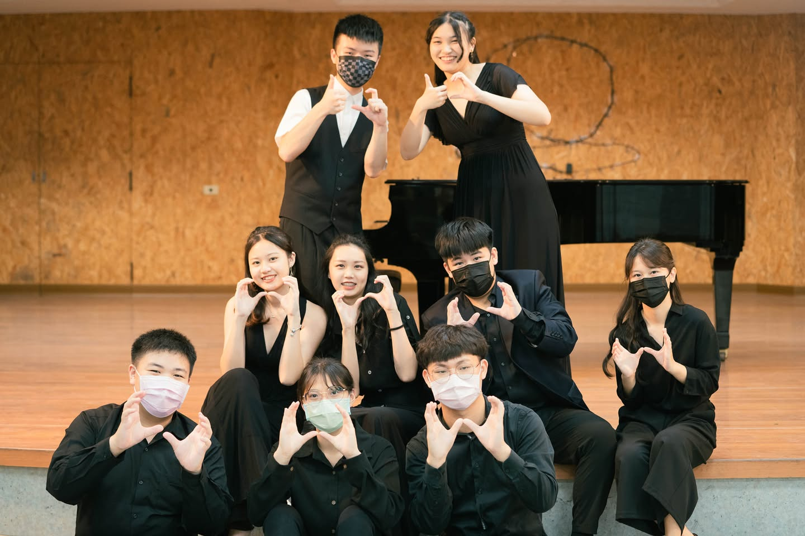

📣 來聽我們的實習音樂會 📣

\#分不出主副修的人類 😵‍💫😵‍💫  
Hello Guys 大家好，我是小胖Fatt⋯阿不是啦。哈囉大家好，我是王則倫！

身為鋼琴小王子 aka 時間管理大師 aka 音樂會負責人 aka（好了可以了），特地想和大家分享一下：雖然是實習音樂會，但我們的前置準備可是一點都不馬虎 ❕ 音樂會一系列的視覺和宣傳全部都從 Moon 出發 🚀  還有大家精心練習的每個節目 🎵。

<!-- truncate -->

希望大家會喜歡這次的『樂球漫步』🤍，也別忘了留到最後，看看我們特地為大家準備的驚喜團體節目 🤩

最後再次誠摯邀請大家，本週四晚間 7 點，在情人節當天一起參加我們的實習音樂會 🥳，跟我們一起 Fly To The Moon 🌕！

📆 日期｜2022/4/14（四）  
🕖 時間｜18:40 開放進場 - 19:00 開始  
📍 地點｜正心中學會卿大樓 四樓演奏廳

### 👀 偶的更多介紹

#### \#鋼琴小王子
他一彈起鋼琴，絕對是視覺與聽覺的一大饗宴 ‼️ 還記得有一次下午主任去出差就讓我們自習，結果他在台上練了整整兩個小時的琴，我們其他三個人在台下睡了整整兩個小時，真的太舒服了 😌

#### \#時間管理大師
他只要一打開電腦或手機，絕對是時間管理的應用程式在運作！才高一的他身兼多職，一天和我們大家一樣只有 24 小時，但他卻要顧好學業、術科、工作，現在甚至還兼任了我們的負責人，他可是一秒都不浪費啊 🤩🤩

#### \#兩副面孔
平常的他在跟我們打屁的時候就像是普通的高中生一樣，有說有笑的，不過一但開始做正事，他馬上就會變成一副嚴肅臉，我們都開玩笑說他絕對可以去應徵海底撈的變臉秀 ‼️😍

---

小編我來偷偷解釋一下為什麼他是「分不出主副修的人類」好了！他是一個很全能的人，只要有想做的事情就絕對會把它做到完美，而鋼琴跟小提琴也是一樣。我們的主副修考試量可是差超級多的呢！如果時間允許他甚至兩個都可以做為主修考試，可見他的能力有多強啊 😍😍。

> 「你去想一想 你去看一看～」

### 🚀 音樂會後：樂球旅行第 16 天

剛抵達地球的我，帶了一些照片 🌍，想和你們這群最棒的人類分享 🤩！

在這裡再次感謝 🙇：來聆賞音樂會的每一個人、最強的演出夥伴們、曾經幫助過我們的朋友和老師、真的超 Carry 的場務，還有旅行中遇見的每一個人 🚀。

樂球漫步，帶你 Fly to the Moon ❤️。

📸 Photographer / @fang.ru628  
🌕 Official Posts / @jhs.sh_music

---

你可以在[這裡](https://youtu.be/COvye-KaTJU)看到完整的音樂會影片。  
在 0:31:14 / 1:03:20 / 1:17:20 可以看到我的演出 (っ'ᵕ')╮ =͟͟͞͞♡