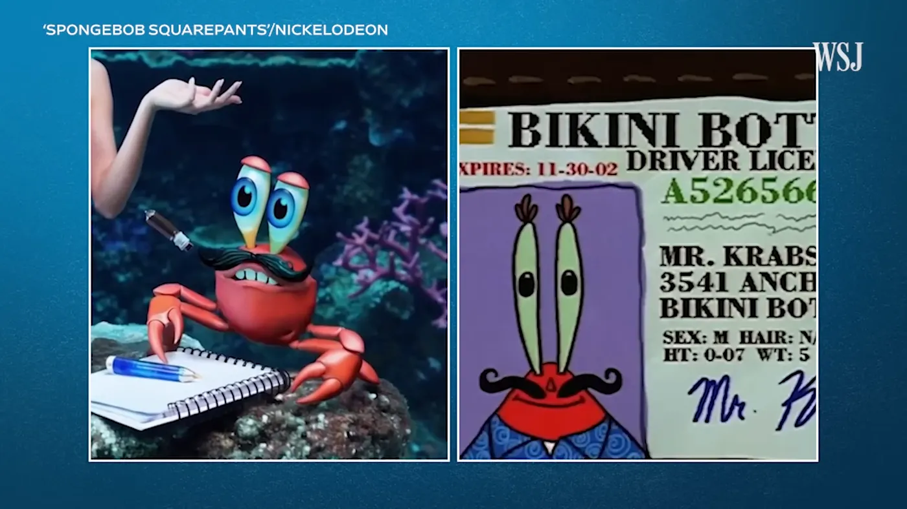

雖然 OpenAI 的 Sora 實力強大，但你有沒有想過它的訓練資料來源呢？

好奇的我做了點研究，約半個月前，OpenAI 的 CTO Mira Murati 接受了《華爾街日報》記者 Joanna Stern 的採訪。當被問及「你們用了哪些數據來訓練 Sora？」時，Mira 僅表示他們使用了公開可獲取的數據，並未能確定具體細節。而當記者追問是否包括 YouTube、Facebook 或 Instagram 等平台的數據時，CTO 則回答說，如果這些數據是公開可獲取的，那麼有可能會被使用，但她並不確定。

<!-- truncate -->

採訪結束時，唯一獲得 Mira 證實的訓練數據來源，僅為 Shutterstock 授權的內容。至於是否利用了其他平台的數據，目前還是一個未知數。有意思的是，《華爾街日報》在採訪前提供了四個指令給 OpenAI，用以生成影片，其中一個生成的影片中出現了類似於蟹老闆的眼睛。

左圖為 Sora 生成的影像，右圖為卡通海綿寶寶的片段。(Source: WSJ)

考量到當前大型語言模型的性能，我直覺上不認為僅用 Shutterstock 的罐頭素材就能創造出這麼多元和逼真的場景。

你，能接受自己發在社群上的東西被拿去訓練嗎🤔

原採訪影片（04:23）：  

<iframe
  class="custom-iframe"
  width="100%"
  height="400"
  src="https://www.youtube-nocookie.com/embed/mAUpxN-EIgU?start=263&modestbranding=1&rel=0"
  title="OpenAI's Sora Made Me Crazy AI Videos—Then the CTO Answered (Most of) My Questions | WSJ"
  frameborder="0"
  allow="accelerometer; autoplay; clipboard-write; encrypted-media; gyroscope; picture-in-picture"
  allowfullscreen>
</iframe>